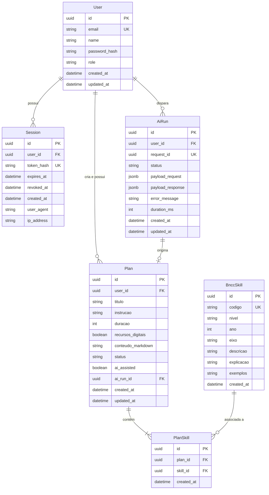

# Data Model: Planejador BNCC para Professores

**Branch**: `001-planejador-bncc` | **Data**: 2026-10-02 | **Spec**: [spec.md](./spec.md)

Este documento especifica o modelo de dados relacional, entidades, restrições de integridade, relacionamentos e regras de validação para o banco de dados PostgreSQL utilizando o Prisma ORM.

---

## 1. Diagrama Entidade-Relacionamento (ERD)



---

## 2. Entidades e Esquema Detalhado

### 2.1. `User` (Docente)
Representa o professor cadastrado e autenticado no sistema.

| Campo | Tipo | Nulo? | Descrição / Restrições |
| :--- | :---: | :---: | :--- |
| `id` | `UUID` | Não | Chave primária gerada via `gen_random_uuid()`. |
| `email` | `String` | Não | Único (`UK`). E-mail institucional do docente (ex: `ana.souza@escola.gov.br`). |
| `name` | `String` | Não | Nome de exibição (ex: `Profª Ana Souza`). |
| `password_hash` | `String` | Não | Hash da senha gerado com `bcrypt` (custo 10). A senha plana jamais é gravada. |
| `role` | `String` | Não | Papel do usuário, default: `"DOCENTE"`. Sem permissões administrativas expostas. |
| `created_at` | `DateTime` | Não | Timestamp de criação (`now()`). |
| `updated_at` | `DateTime` | Não | Timestamp da última atualização (`now()`). |

### 2.2. `Session` (Sessão / Refresh Token)
Armazena as sessões ativas com o hash dos refresh tokens para rotação segura e encerramento explícito (logout).

| Campo | Tipo | Nulo? | Descrição / Restrições |
| :--- | :---: | :---: | :--- |
| `id` | `UUID` | Não | Chave primária (`PK`). |
| `user_id` | `UUID` | Não | Chave estrangeira (`FK -> User.id`) com deleção em cascata (`CASCADE`). |
| `token_hash` | `String` | Não | Único (`UK`). Hash criptográfico SHA-256 do refresh token emitido. |
| `expires_at` | `DateTime` | Não | Data/hora de expiração (fixada em 8 horas a partir da emissão). |
| `revoked_at` | `DateTime` | Sim | Data/hora de revogação explícita (preenchida no logout). |
| `created_at` | `DateTime` | Não | Timestamp de emissão (`now()`). |
| `user_agent` | `String` | Sim | Informações do navegador para auditoria. |
| `ip_address` | `String` | Sim | Endereço IP do cliente no momento da autenticação. |

### 2.3. `BnccSkill` (Habilidade da BNCC)
Catálogo oficial de habilidades pedagógicas em modo estrito de somente leitura para os docentes.

| Campo | Tipo | Nulo? | Descrição / Restrições |
| :--- | :---: | :---: | :--- |
| `id` | `UUID` | Não | Chave primária (`PK`). |
| `codigo` | `String` | Não | Único (`UK`). Código oficial da BNCC (ex: `EF01CO01`, `EF02CO02`). |
| `nivel` | `String` | Não | Nível de ensino (ex: `"Ensino Fundamental"`). |
| `ano` | `Int` | Sim | Ano escolar quando aplicável (ex: `1`, `2`, `5`). Nulo para etapas sem ano fixo. |
| `eixo` | `String` | Não | Componente ou eixo temático (ex: `"Pensamento Computacional (PC)"`). |
| `descricao` | `Text` | Não | Texto descritivo oficial da habilidade. |
| `explicacao` | `Text` | Sim | Contextualização pedagógica oficial. |
| `exemplos` | `Text` | Sim | Exemplos práticos de aplicação em sala de aula. |
| `created_at` | `DateTime` | Não | Timestamp de carga (`now()`). |

### 2.4. `Plan` (Plano de Aula)
Proposta didática criada pelo docente com apoio de IA e mantida em estado editável de rascunho privado.

| Campo | Tipo | Nulo? | Descrição / Restrições |
| :--- | :---: | :---: | :--- |
| `id` | `UUID` | Não | Chave primária (`PK`). |
| `user_id` | `UUID` | Não | Chave estrangeira (`FK -> User.id`). Isolamento estrito de proprietário. |
| `titulo` | `String(100)`| Não | Título do plano (máx. 100 caracteres). Extraído do retorno da IA ou editado. |
| `instrucao` | `Text` | Não | Orientação pedagógica digitada pelo professor (10 a 1.000 caracteres). |
| `duracao` | `Int` | Não | Duração estimada da aula (entre 15 e 360 minutos). |
| `recursos_digitais`| `Boolean` | Não | Indica se utilizará tecnologia digital em aula. |
| `conteudo_markdown`| `Text` | Não | Conteúdo pedagógico integral em formato Markdown editável. |
| `status` | `PlanStatus`| Não | Enum: fixado estritamente em `'RASCUNHO'`. |
| `ai_assisted` | `Boolean` | Não | Flag obrigatória com valor `true`, indicando auxílio de IA. |
| `ai_run_id` | `UUID` | Sim | Chave estrangeira (`FK -> AiRun.id`) associando à execução que gerou o rascunho. |
| `created_at` | `DateTime` | Não | Timestamp de criação (`now()`). |
| `updated_at` | `DateTime` | Não | Timestamp da última modificação salva (`now()`). |

### 2.5. `PlanSkill` (Associação N:M Plano ⇄ Habilidade)
Tabela associativa entre o plano de aula e as habilidades curriculares selecionadas.

| Campo | Tipo | Nulo? | Descrição / Restrições |
| :--- | :---: | :---: | :--- |
| `id` | `UUID` | Não | Chave primária (`PK`). |
| `plan_id` | `UUID` | Não | Chave estrangeira (`FK -> Plan.id`) com deleção em cascata (`CASCADE`). |
| `skill_id` | `UUID` | Não | Chave estrangeira (`FK -> BnccSkill.id`) com restrição `RESTRICT`. |
| `created_at` | `DateTime` | Não | Timestamp de associação. |

*Restrição Única*: `UNIQUE(plan_id, skill_id)`.

### 2.6. `AiRun` (Auditoria e Execução da IA)
Registra cada solicitação de geração disparada contra o workflow n8n para fins de resiliência e auditoria.

| Campo | Tipo | Nulo? | Descrição / Restrições |
| :--- | :---: | :---: | :--- |
| `id` | `UUID` | Não | Chave primária (`PK`). |
| `user_id` | `UUID` | Não | Chave estrangeira (`FK -> User.id`). |
| `request_id` | `UUID` | Não | Único (`UK`). Identificador único da requisição para rastreabilidade nos logs. |
| `status` | `AiRunStatus`| Não | Enum: `'PENDING'`, `'SUCCEEDED'`, `'FAILED'`. |
| `payload_request` | `JsonB` | Não | Cópia exata dos 5 campos enviados ao n8n. |
| `payload_response`| `JsonB` | Sim | Payload retornado pelo n8n em caso de sucesso. |
| `error_message` | `String` | Sim | Mensagem de erro capturada em caso de falha ou timeout. |
| `duration_ms` | `Int` | Sim | Tempo total da chamada em milissegundos. |
| `created_at` | `DateTime` | Não | Timestamp de início do processamento. |
| `updated_at` | `DateTime` | Não | Timestamp de finalização da execução. |

---

## 3. Máquinas de Estado e Transições

### 3.1. Ciclo de Vida da Execução de IA (`AiRunStatus`)

```
                  ┌──────────────┐
                  │   PENDING    │
                  └──────┬───────┘
                         │
         ┌───────────────┴───────────────┐
         ▼                               ▼
  [Sucesso n8n]                   [Falha / Timeout]
  (Transação atômica)             (Sem criar plano)
         │                               │
         ▼                               ▼
  ┌──────────────┐                ┌──────────────┐
  │  SUCCEEDED   │                │    FAILED    │
  └──────────────┘                └──────────────┘
```

* **Transição Atômica de Sucesso**:
  Ao receber retorno válido do n8n com `success: true`:
  1. Cria registro `Plan` com status `RASCUNHO` e `ai_assisted: true`.
  2. Cria associações `PlanSkill` para as habilidades selecionadas.
  3. Atualiza `AiRun` para status `SUCCEEDED` com `duration_ms` e `payload_response`.
  *Tudo executado dentro de uma única transação interativa do Prisma (`prisma.$transaction`).*
* **Transição de Falha**:
  Caso ocorra timeout (> 45s), erro de rede ou resposta malformada:
  1. Atualiza `AiRun` para `FAILED` com `error_message` e `duration_ms`.
  2. **Nenhum** registro é criado na tabela `Plan` ou `PlanSkill`.

### 3.2. Ciclo de Vida do Plano (`PlanStatus`)
* O plano nasce estritamente com `status = 'RASCUNHO'`.
* Edições posteriores atualizam `conteudo_markdown`, `titulo` e `updated_at`, mantendo o status em `'RASCUNHO'`.
* Não há transição para `FINALIZADO`, `PUBLICADO` ou exclusão nesta versão (FR-017).

---

## 4. Regras de Validação no Nível de Dados

1. **Título do Plano**: Obrigatório, string entre 1 e 100 caracteres.
2. **Instrução Pedagógica**: Obrigatória, texto entre 10 e 1.000 caracteres.
3. **Duração**: Inteiro obrigatório entre 15 e 360 minutos.
4. **Isolamento de Tenant**: Todo `Plan`, `AiRun` e `Session` pertence a exatamente um `User`.
5. **Prevenção de IDOR**: Consultas de plano sempre filtram `WHERE id = :id AND user_id = :userId`. Se não corresponder, a API lança `NotFoundException` (404), ocultando a existência do plano.

---

## 5. Esquema Canônico Prisma (`schema.prisma`)

```prisma
datasource db {
  provider = "postgresql"
  url      = env("DATABASE_URL")
}

generator client {
  provider = "prisma-client-js"
}

enum PlanStatus {
  RASCUNHO
}

enum AiRunStatus {
  PENDING
  SUCCEEDED
  FAILED
}

model User {
  id            String      @id @default(uuid()) @db.Uuid
  email         String      @unique @db.VarChar(255)
  name          String      @db.VarChar(255)
  passwordHash  String      @map("password_hash") @db.VarChar(255)
  role          String      @default("DOCENTE") @db.VarChar(50)
  createdAt     DateTime    @default(now()) @map("created_at")
  updatedAt     DateTime    @updatedAt @map("updated_at")

  sessions      Session[]
  plans         Plan[]
  aiRuns        AiRun[]

  @@map("users")
}

model Session {
  id          String    @id @default(uuid()) @db.Uuid
  userId      String    @map("user_id") @db.Uuid
  tokenHash   String    @unique @map("token_hash") @db.VarChar(255)
  expiresAt   DateTime  @map("expires_at")
  revokedAt   DateTime? @map("revoked_at")
  createdAt   DateTime  @default(now()) @map("created_at")
  userAgent   String?   @map("user_agent") @db.Text
  ipAddress   String?   @map("ip_address") @db.VarChar(45)

  user        User      @relation(fields: [userId], references: [id], onDelete: Cascade)

  @@index([userId])
  @@map("sessions")
}

model BnccSkill {
  id          String      @id @default(uuid()) @db.Uuid
  codigo      String      @unique @db.VarChar(20)
  nivel       String      @db.VarChar(100)
  ano         Int?
  eixo        String      @db.VarChar(150)
  descricao   String      @db.Text
  explicacao  String?     @db.Text
  exemplos    String?     @db.Text
  createdAt   DateTime    @default(now()) @map("created_at")

  planSkills  PlanSkill[]

  @@index([codigo])
  @@index([nivel, ano])
  @@map("bncc_skills")
}

model Plan {
  id               String      @id @default(uuid()) @db.Uuid
  userId           String      @map("user_id") @db.Uuid
  titulo           String      @db.VarChar(100)
  instrucao        String      @db.Text
  duracao          Int
  recursosDigitais Boolean     @map("recursos_digitais")
  conteudoMarkdown String      @map("conteudo_markdown") @db.Text
  status           PlanStatus  @default(RASCUNHO)
  aiAssisted       Boolean     @default(true) @map("ai_assisted")
  aiRunId          String?     @unique @map("ai_run_id") @db.Uuid
  createdAt        DateTime    @default(now()) @map("created_at")
  updatedAt        DateTime    @updatedAt @map("updated_at")

  user             User        @relation(fields: [userId], references: [id], onDelete: Cascade)
  aiRun            AiRun?      @relation(fields: [aiRunId], references: [id])
  skills           PlanSkill[]

  @@index([userId])
  @@map("plans")
}

model PlanSkill {
  id        String    @id @default(uuid()) @db.Uuid
  planId    String    @map("plan_id") @db.Uuid
  skillId   String    @map("skill_id") @db.Uuid
  createdAt DateTime  @default(now()) @map("created_at")

  plan      Plan      @relation(fields: [planId], references: [id], onDelete: Cascade)
  skill     BnccSkill @relation(fields: [skillId], references: [id], onDelete: Restrict)

  @@unique([planId, skillId])
  @@map("plan_skills")
}

model AiRun {
  id              String      @id @default(uuid()) @db.Uuid
  userId          String      @map("user_id") @db.Uuid
  requestId       String      @unique @map("request_id") @db.Uuid
  status          AiRunStatus @default(PENDING)
  payloadRequest  Json        @map("payload_request")
  payloadResponse Json?       @map("payload_response")
  errorMessage    String?     @map("error_message") @db.Text
  durationMs      Int?        @map("duration_ms")
  createdAt       DateTime    @default(now()) @map("created_at")
  updatedAt       DateTime    @updatedAt @map("updated_at")

  user            User        @relation(fields: [userId], references: [id], onDelete: Cascade)
  plan            Plan?

  @@index([userId])
  @@map("ai_runs")
}
```
