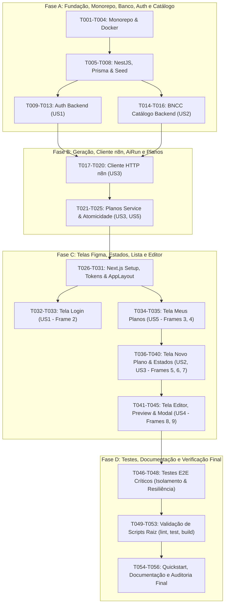

# Tasks: Planejador BNCC para Professores

**Branch**: `001-planejador-bncc` | **Data**: 2026-10-02 | **Spec**: [spec.md](./spec.md) | **Plan**: [plan.md](./plan.md)

Este documento define a lista de tarefas acionáveis e ordenadas por dependência para a implementação completa do Planejador BNCC, estruturada rigorosamente nas quatro fases solicitadas:
* **Fase A**: Monorepo, scripts, ambiente, banco, Prisma, autenticação e catálogo (Fundação, US1 e US2 backend).
* **Fase B**: Geração, cliente n8n, validação, AiRun e privacidade de planos (US3 e US5 backend e regras de negócio).
* **Fase C**: Telas Figma, estados, lista e editor (Frontend com Design System para US1 a US5).
* **Fase D**: Testes, documentação e verificação final (Testes E2E, validação do quickstart e auditoria).

---

## Phase A: Monorepo, Scripts, Ambiente, Banco, Prisma, Autenticação e Catálogo

**Objetivo**: Estabelecer a infraestrutura do monorepo pnpm, banco PostgreSQL no Docker, esquema relacional Prisma com seed idempotente e os módulos backend de autenticação segura (US1) e catálogo BNCC (US2).

### Setup e Infraestrutura Monorepo

- [X] T001 Configurar a estrutura raiz do monorepo pnpm com workspaces para `apps/web` e `apps/api` em `pnpm-workspace.yaml` e `package.json`
- [X] T002 [P] Configurar scripts raiz no `package.json` (`dev`, `lint`, `typecheck`, `test`, `test:integration`, `build`) e arquivo `.npmrc`
- [X] T003 [P] Criar configuração do serviço PostgreSQL 16 com healthcheck e volume persistente em `docker-compose.yml`
- [X] T004 [P] Criar arquivos de configuração de ambiente e exemplos em `.env.example`, `apps/api/.env.example` e `apps/web/.env.example`

### Banco de Dados e Modelos Prisma

- [X] T005 Inicializar o projeto NestJS 11 em `apps/api/package.json` e `apps/api/tsconfig.json`
- [X] T006 Definir o esquema canônico do Prisma com as entidades `User`, `Session`, `BnccSkill`, `Plan`, `PlanSkill` e `AiRun` em `apps/api/prisma/schema.prisma`
- [X] T007 Gerar e aplicar a migração inicial determinística do PostgreSQL em `apps/api/prisma/migrations/0001_init/migration.sql`
- [X] T008 Implementar script de seed idempotente carregando as 2 contas demo locais (com hash bcrypt) e as habilidades de `docs/data/bncc-recorte.json` via upsert em `apps/api/prisma/seed.ts`

### Backend: Autenticação de Docente (US1)

- [X] T009 [P] [US1] Escrever testes unitários do serviço de autenticação (geração de tokens, hash de senha e validação de sessão) em `apps/api/src/auth/auth.service.spec.ts`
- [X] T010 [US1] Implementar serviço de autenticação com bcrypt para senhas e SHA-256 para refresh tokens em `apps/api/src/auth/auth.service.ts`
- [X] T011 [US1] Implementar estratégias JWT (Access Token de 15 minutos em memória e Guards de proteção) em `apps/api/src/auth/guards/jwt-auth.guard.ts`
- [X] T012 [US1] Implementar controller de autenticação com rotas `POST /api/auth/login`, `POST /api/auth/refresh`, `POST /api/auth/logout` e `GET /api/auth/me` com cookie HttpOnly `SameSite=Lax` em `apps/api/src/auth/auth.controller.ts`
- [X] T013 [P] [US1] Escrever testes de integração dos endpoints de autenticação e proteção contra CSRF em `apps/api/test/auth.e2e-spec.ts`

### Backend: Catálogo de Habilidades BNCC (US2)

- [X] T014 [P] [US2] Escrever testes unitários do serviço de consulta e filtragem da BNCC em `apps/api/src/bncc/bncc.service.spec.ts`
- [X] T015 [US2] Implementar serviço de catálogo com filtros por `q` (código ou texto), `nivel`, `ano` e `eixo` em modo somente leitura em `apps/api/src/bncc/bncc.service.ts`
- [X] T016 [US2] Implementar controller do catálogo BNCC para as rotas `GET /api/bncc/skills` e `GET /api/bncc/skills/:codigo` protegidas por JWT em `apps/api/src/bncc/bncc.controller.ts`

**Critério de Conclusão da Fase A**: O container PostgreSQL sobe via `docker compose`, o seed roda de forma idempotente, a autenticação emite cookies HttpOnly seguros e o catálogo BNCC responde com filtros combinados com 100% dos testes unitários da Fase A passando.

---

## Phase B: Geração, Cliente n8n, Validação, AiRun e Privacidade de Planos

**Objetivo**: Implementar o cliente HTTP com o webhook n8n conforme o contrato confirmado em `docs/contracts/n8n.md`, auditoria com `AiRun`, atomicidade em falhas/sucesso (US3) e autorização estrita por docente com proteção IDOR (US5).

### Cliente n8n e Resiliência (US3)

- [X] T017 [P] [US3] Escrever testes unitários para validação do schema Zod de resposta do n8n e tratamento de erros em `apps/api/src/ai/n8n.schema.spec.ts`
- [X] T018 [US3] Definir o schema Zod de parsing estrito da resposta do n8n (`success: true`, `answer: string`, `format: "markdown"`, `sessao`, `habilidade`) em `apps/api/src/ai/n8n.schema.ts`
- [X] T019 [P] [US3] Escrever testes unitários para o cliente HTTP n8n simulando sucesso, timeout aos 45s, erro 500 e mock mode em `apps/api/src/ai/n8n.client.spec.ts`
- [X] T020 [US3] Implementar o cliente HTTP `N8nClient` com cabeçalho `x-api-key`, `requestId` UUID, timeout de 45 segundos via `AbortSignal.timeout(45000)`, sem retry automático e suporte a `N8N_MOCK_MODE=true` em `apps/api/src/ai/n8n.client.ts`

### Backend: Planos de Aula, AiRun e Atomicidade (US3, US4, US5)

- [X] T021 [P] [US3] Escrever testes unitários do serviço de planos cobrindo transação atômica em sucesso e falha de IA em `apps/api/src/plans/plans.service.spec.ts`
- [X] T022 [US3] Implementar método `generatePlan` com criação de `AiRun` (PENDING), chamada ao n8n e transação Prisma interativa criando `Plan` (RASCUNHO, auxílio IA) e marcando `SUCCEEDED`, ou marcando `FAILED` sem criar planos parciais em caso de falha em `apps/api/src/plans/plans.service.ts`
- [X] T023 [US5] Implementar métodos `listPlans`, `getPlanById` e `updatePlan` com filtro obrigatório `where: { userId }` e lançamento de `404 Not Found` em caso de acesso a plano alheio em `apps/api/src/plans/plans.service.ts`
- [X] T024 [US3] Implementar controller `PlansController` com rotas `POST /api/plans/generate`, `GET /api/plans`, `GET /api/plans/:id` e `PUT /api/plans/:id` em `apps/api/src/plans/plans.controller.ts`
- [X] T025 [P] [US5] Escrever testes de integração de API cobrindo bloqueio de IDOR (404 em plano de outro professor) e persistência atômica em `apps/api/test/plans.e2e-spec.ts`

**Critério de Conclusão da Fase B**: A rota de geração consome o n8n (ou modo mock) com validação Zod estrita, grava plano apenas em sucesso atômico, aborta sem salvar registros parciais em caso de falha/timeout e isola rigorosamente os dados entre docentes (retornando 404 para terceiros).

---

## Phase C: Telas Figma, Estados, Lista e Editor

**Objetivo**: Construir a aplicação frontend em Next.js 15 App Router utilizando tokens e CSS puro (sem Tailwind), reproduzindo com fidelidade absoluta os 9 frames aprovados do Figma, estados de formulário, navegação, loading, falha, editor e modal de saída.

### Setup Frontend e Design System Tokens

- [ ] T026 Inicializar a aplicação Next.js 15 com React 19 e TypeScript em `apps/web/package.json` e `apps/web/tsconfig.json`
- [ ] T027 [P] Criar o arquivo central de tokens CSS (`tokens.css`) extraído do Frame 1 (`2:11440`), com variáveis de cores institucionais, neutros, alertas, tipografia Inter/Roboto Mono, sombras e border-radius em `apps/web/src/styles/tokens.css`
- [ ] T028 [P] Implementar componentes reutilizáveis base (Button, Badge, Input, Textarea, Card, Chip, Alert, Modal, Checkbox) com CSS Modules em `apps/web/src/components/ui/`
- [ ] T029 Implementar cliente HTTP do frontend com suporte a renovação automática de token JWT e cookies com credenciais em `apps/web/src/services/api.ts`
- [ ] T030 Implementar contexto de autenticação com Access Token mantido estritamente em memória e restauração silenciosa de sessão em `apps/web/src/context/auth-context.tsx`
- [ ] T031 Implementar layout base `AppLayout` com sidebar fixa (232px), marca institucional, links de navegação ativos, card de privacidade e topbar com avatar e logout em `apps/web/src/components/layout/app-layout.tsx`

### Tela 1: Login com Credenciais Inválidas e Contas Demo (US1 - Frame 2)

- [ ] T032 [P] [US1] Criar estilos em CSS Module para o layout bipartido institucional/login em `apps/web/src/app/login/login.module.css`
- [ ] T033 [US1] Implementar a página de login com painel institucional à esquerda (600px), formulário à direita com banner de erro `#FDECEC` para credenciais inválidas e cards interativos com ação rápida "Usar conta" para Ana Souza e Marcos Lima (Frame 2 `2:11755`) em `apps/web/src/app/login/page.tsx`

### Tela 2: Meus Planos e Estado Vazio (US5 - Frames 3 e 4)

- [ ] T034 [P] [US5] Criar estilos em CSS Module para a listagem e tabela de planos em `apps/web/src/app/planos/planos.module.css`
- [ ] T035 [US5] Implementar a página de Meus Planos com campo de busca, contador de rascunhos, listagem com badges `RASCUNHO` e `Auxílio por IA`, e estado vazio acolhedor com ilustração SVG e botão "+ Criar primeiro plano" (Frames 3 `2:11830` e 4 `2:11932`) em `apps/web/src/app/planos/page.tsx`

### Tela 3: Novo Plano — Formulário, Preparando e Falha (US2, US3 - Frames 5, 6 e 7)

- [ ] T036 [P] [US2] Criar estilos em CSS Module para o formulário de criação em duas colunas e catálogo BNCC em `apps/web/src/app/planos/novo/novo.module.css`
- [ ] T037 [US2] Implementar componente do catálogo BNCC com campo de busca com lupa, selects de Nível, Ano e Eixo, botão "Limpar filtros", listagem com checkboxes e chips removíveis de habilidades selecionadas em `apps/web/src/components/bncc/bncc-catalog.tsx`
- [ ] T038 [US3] Implementar formulário de contexto pedagógico com validação inline de duração (15-360 min), instrução (10-1000 chars), recursos digitais e banner de alerta antes de gerar (Frame 5 `2:11990`) em `apps/web/src/app/planos/novo/page.tsx`
- [ ] T039 [US3] Implementar estado visual de preparação com banner `#EAF3FC`, spinner animado, barra de progresso visual, bloqueio de reenvio duplo e desabilitação do formulário (Frame 6 `2:12155`) em `apps/web/src/app/planos/novo/loading-state.tsx`
- [ ] T040 [US3] Implementar estado de falha de geração com banner de erro `#FDECEC`, preservação integral de todos os campos digitados e seleções BNCC, e botão ativo "Tentar gerar novamente" sem repetição automática (Frame 7 `2:12329`) em `apps/web/src/app/planos/novo/error-state.tsx`

### Tela 4: Editor Markdown, Pré-visualização e Diálogo de Saída (US4 - Frames 8 e 9)

- [ ] T041 [P] [US4] Criar estilos em CSS Module para o editor com split-view desktop e abas mobile em `apps/web/src/app/planos/[id]/editor.module.css`
- [ ] T042 [US4] Implementar barra de ferramentas de formatação (Bold, Italic, Listas, Link) e textarea com fonte `Roboto Mono` em `apps/web/src/components/editor/markdown-toolbar.tsx`
- [ ] T043 [US4] Implementar componente de pré-visualização formatada com sanitização estrita via `rehype-sanitize` e `react-markdown` (sem execução de HTML arbitrário) em `apps/web/src/components/editor/markdown-preview.tsx`
- [ ] T044 [US4] Implementar a página do editor de rascunho com abas ("Editor Markdown" e "Pré-visualização"), split-view desktop, botão "Salvar alterações" e banner verde de confirmação `#E9F6EF` (Frame 8 `2:12495`) em `apps/web/src/app/planos/[id]/page.tsx`
- [ ] T045 [US4] Implementar modal de confirmação de saída "Sair sem salvar?" sobre backdrop escurecido, alertando alterações não salvas com botões "Continuar editando" e "Sair sem salvar" (Frame 9 `2:12608`) em `apps/web/src/components/editor/exit-confirmation-modal.tsx`

**Critério de Conclusão da Fase C**: Todas as 4 telas e seus respectivos estados visuais estão funcionais, estilizados estritamente com os tokens e fontes do Figma (sem Tailwind), com layout responsivo (split-view no desktop e abas no mobile) e interações de login, catálogo, geração, edição e saída validadas no browser.

---

## Phase D: Testes, Documentação e Verificação Final

**Objetivo**: Executar suítes completas de testes automatizados unitários e de integração, validar os cenários de ponta a ponta do `quickstart.md`, auditar higiene de versionamento e certificar todos os critérios de aceitação.

### Testes Críticos e Integração Ponta a Ponta

- [ ] T046 [P] Escrever suíte de testes de isolamento estrito entre docentes validando que Professor 2 recebe 404 ao tentar acessar planos de Professor 1 em `apps/api/test/isolation.e2e-spec.ts`
- [ ] T047 [P] Escrever suíte de testes de integração da atomicidade da geração com IA (verificando que falha no n8n não cria registro em `Plan`) em `apps/api/test/ai-resilience.e2e-spec.ts`
- [ ] T048 Escrever testes de integração dos fluxos de interface no frontend (busca no catálogo, validação de campos do formulário e alternância entre editor e preview) em `apps/web/test/flows.spec.tsx`

### Scripts Raiz e Verificação de Qualidade

- [ ] T049 Executar e validar sem erros o comando de verificação de tipos `pnpm typecheck` em todo o monorepo
- [ ] T050 Executar e validar sem erros o comando de linting `pnpm lint` em todo o monorepo
- [ ] T051 Executar e validar com 100% de sucesso todos os testes unitários via `pnpm test`
- [ ] T052 Executar e validar com 100% de sucesso todos os testes de integração e e2e via `pnpm test:integration`
- [ ] T053 Executar e validar a compilação completa de produção das duas aplicações via `pnpm build`

### Documentação e Auditoria de Segurança

- [ ] T054 [P] Validar e atualizar se necessário os comandos e passos do guia de execução em `specs/001-planejador-bncc/quickstart.md`
- [ ] T055 Documentar no README do projeto o ajuste de cookies HttpOnly (localhost com HTTP vs produção com HTTPS/Secure) e configurações do Docker em `README.md`
- [ ] T056 Auditar o repositório garantindo que nenhum arquivo `.env`, credencial real ou segredo foi incluído no controle de versão Git

**Critério de Conclusão da Fase D**: Todos os scripts raiz (`dev`, `lint`, `typecheck`, `test`, `test:integration`, `build`) executam com sucesso, a cobertura de testes críticos de autorização e resiliência é confirmada, o `quickstart.md` é validado e o repositório está limpo e pronto para entrega.

---

## Dependências e Ordem de Execução

---

## Oportunidades de Execução Paralela

* **Na Fase A**:
  * Tarefas T002 (scripts raiz), T003 (Docker Compose) e T004 (.env) podem ser criadas em paralelo.
  * Tarefas T009 (testes auth) e T014 (testes catálogo) podem ser implementadas em paralelo.
* **Na Fase B**:
  * Tarefas T017 (schema n8n) e T019 (testes client n8n) podem ser desenvolvidas em paralelo.
  * Tarefas T021 (testes planos) e T025 (testes IDOR e2e) podem ser preparadas em paralelo.
* **Na Fase C**:
  * Tarefas de estilização modular T027 (tokens.css), T032 (login.module.css), T034 (planos.module.css) e T036 (novo.module.css) podem rodar em paralelo.
  * Componentes desacoplados de UI T028 e o cliente de API T029 podem ser desenvolvidos em paralelo.
* **Na Fase D**:
  * Tarefas T046 (testes isolamento), T047 (testes resiliência) e T048 (testes frontend) podem ser executadas simultaneamente.

---

## Estratégia de MVP e Entrega Incremental

1. **MVP Funcional (Fase A + B)**:
   * Backend completo funcional com login, catálogo e endpoint de geração atômica com testes passando.
2. **Entrega de Interface (Fase C)**:
   * Integração de todos os fluxos no frontend com fidelidade total aos 9 frames aprovados do Figma.
3. **Certificação e Fechamento (Fase D)**:
   * Execução de todos os scripts da raiz e garantia de cobertura nos testes críticos antes de qualquer merge.
